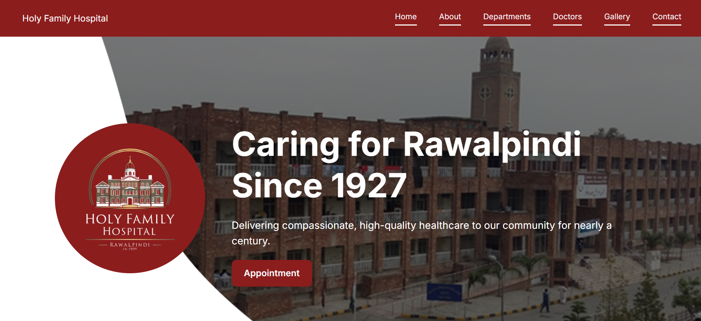
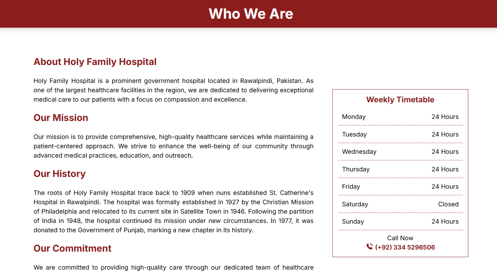
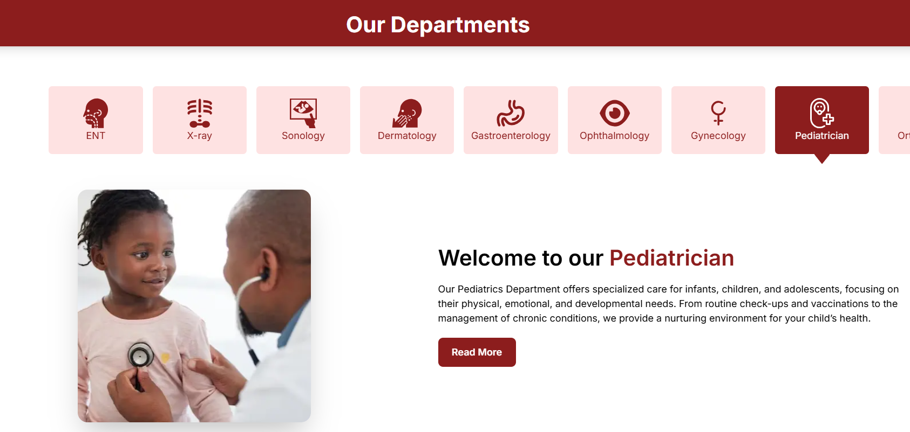
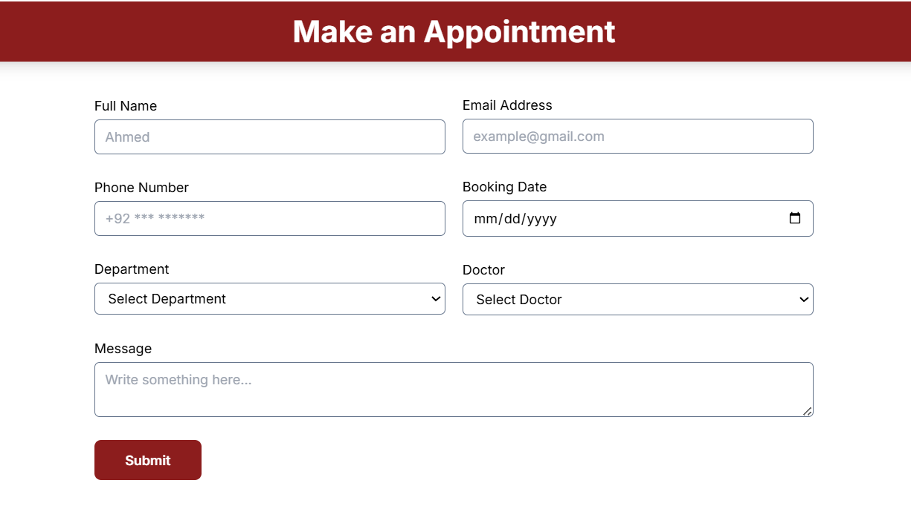
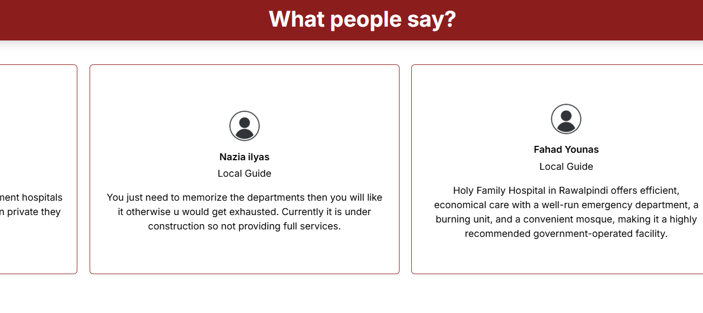
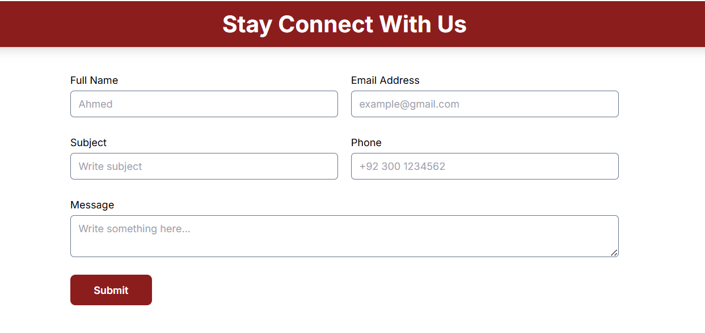
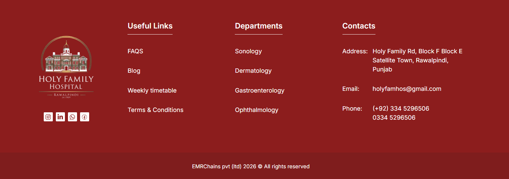

# Holy Family Hospital Website

A proposed hospital website for Holy Family Hospital, Rawalpindi, designed to present hospital information, departments, doctor profiles, appointment booking, gallery, testimonials, and contact options.

> Built with Next.js, React.js, Tailwind CSS, and deployed on Vercel.




## Live Demo

https://holy-family-hospital.vercel.app/


## Overview

This project is a modern hospital website concept for Holy Family Hospital, Rawalpindi. It provides a clean and accessible interface for patients to explore hospital services, view specialist doctors, book appointments, browse gallery images, read testimonials, and contact the hospital.


## Features

- Hospital overview section
- Departments listing
- Appointment booking form
- Doctor/specialist profiles
- Gallery section
- Testimonials
- Contact form
- Responsive user interface
- Clean healthcare-focused design
- Vercel deployment


## Tech Stack

### Frontend

- Next.js
- React.js
- Tailwind CSS
- JavaScript

### Deployment

- Vercel


## Screenshots

### Home


### About



### Departments



### Appointment



### Testimonials



### Contact



### Footer




## Project Structure

```text
holy-family-hospital/
├── app/
│   ├── api/
│   │   └── contact/
│   ├── components/
│   ├── lib/
│   ├── svgs/
│   ├── favicon.ico
│   ├── globals.css
│   ├── layout.js
│   └── page.js
├── data/
├── public/
└── screenshots/
```


## What I Learned

- Building healthcare-focused web interfaces
- Designing responsive layouts with Tailwind CSS
- Building contact and appointment forms
- Deploying frontend projects on Vercel


## Future Improvements

- Backend appointment management
- Doctor availability scheduling
- Admin dashboard
- Patient authentication
- Email/SMS appointment notifications
- Online medical reports section
- Search and filter for doctors/departments
- Multilingual support


## If you found this project interesting, consider giving it a star ⭐
